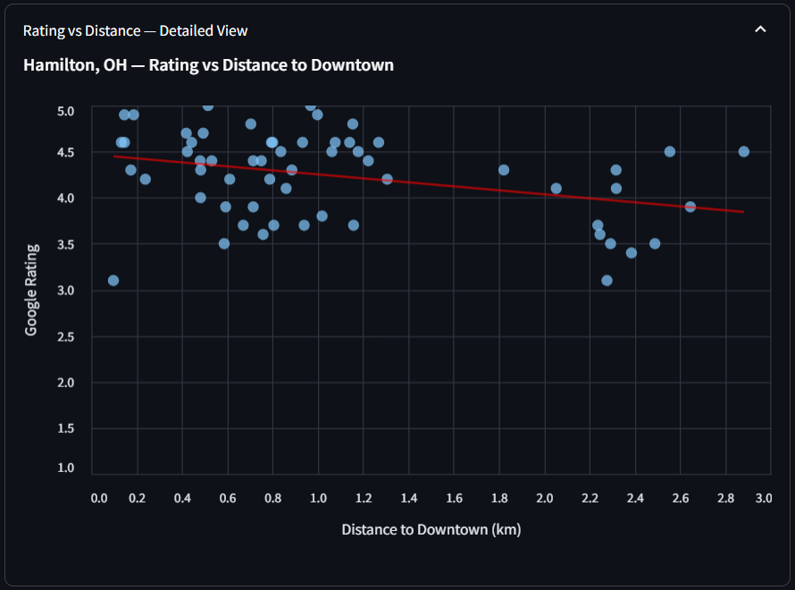
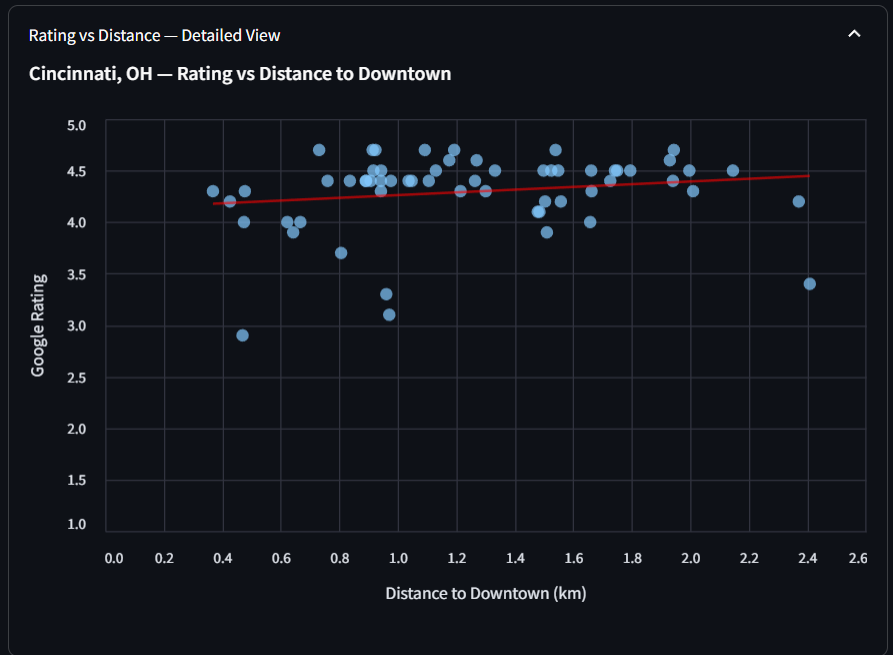

# 📍 Location-Based Restaurant Analysis: Downtown Business Explorer
## Project Overview

This project explores location-based patterns in restaurant quality and competition across multiple Ohio cities (Hamilton, Cincinnati, and Westchester) using publicly available business data from the Google Places API.

The goal is not to predict revenue or business success directly, but to answer practical, exploratory questions such as:

- How far does "downtown" actually extend in functional terms?

- Does proximity to downtown relate to restaurant ratings?

- How is restaurant quality distributed spatially across the urban core?

- How do patterns differ across different cities in the same region?

The project is designed as a foundational location-intelligence analysis that can later be extended with additional data sources (e.g., foot traffic, POS data, demographics) or machine learning models.

## 🌐 Live Application

**The interactive dashboard is hosted on Streamlit Community Cloud:**

[🔗 **Access the Live App**](https://your-app-name.streamlit.app) *(URL to be updated)*

The web application provides an interactive interface to explore restaurant data across all three cities with:
- Interactive maps showing restaurant locations
- Real-time filtering and data exploration
- Visual scatter plots with trendlines
- Detailed restaurant information and ratings

## Data Source

- **Google Places API (Web Service)**
- Business entities correspond to Google Business Profiles
- **Data collected for restaurants within a 3 km (3000 meter) radius of each downtown center**
- Three cities analyzed: Hamilton, OH; Cincinnati, OH; and Westchester, OH
- Each city dataset contains up to 60 restaurants (Google Places API limit)

### Key fields used:

- Business name and status
- Latitude / longitude coordinates
- Rating and review counts
- Price level (when available)
- Opening status
- Place ID (for deduplication and future joins)
- Distance to downtown (calculated using Haversine formula)

API responses are cached locally and all downstream analysis is performed on saved datasets to avoid repeated API calls.

## Research Question 1
### 📌 How far does "downtown" extend, and does distance from downtown relate to restaurant ratings?

### Motivation:

"Downtown" is often treated as a fixed concept, but analytically it should be defined by observable changes in business patterns, not intuition or administrative boundaries.

As a first step, this analysis examines whether distance from the city center is associated with restaurant ratings across three Ohio cities.

### Methodology

#### 1. Define downtown reference points

Single latitude/longitude coordinates representing each downtown were selected and used consistently across queries and feature engineering.

**Downtown Coordinates:**
- **Hamilton, OH**: `39.3995, -84.5613`
- **Cincinnati, OH**: `39.095, -84.514`
- **Westchester, OH**: `39.335, -84.404`

#### 2. Data Collection

Restaurants were collected using Google Places Nearby Search API with:
- **Search radius: 3000 meters (3 kilometers)** - Extended from the original 2 km to capture a broader downtown area
- Type filter: "restaurant"
- Pagination handled to collect up to 60 results per city (API maximum)

#### 3. Compute distance to downtown

For each restaurant, the great-circle (Haversine) distance from downtown was calculated and added as a new feature.

```python
def haversine_km(lat1, lon1, lat2, lon2):
    R = 6371  # Earth radius in kilometers
    lat1, lon1, lat2, lon2 = map(np.radians, [lat1, lon1, lat2, lon2])
    dlat = lat2 - lat1
    dlon = lon2 - lon1
    a = np.sin(dlat/2)**2 + np.cos(lat1) * np.cos(lat2) * np.sin(dlon/2)**2
    return 2 * R * np.arcsin(np.sqrt(a))
```

```python
df["distance_to_downtown_km"] = haversine_km(
    DOWNTOWN_LAT,
    DOWNTOWN_LNG,
    df["geometry.location.lat"],
    df["geometry.location.lng"]
)
```

#### 4. Visualize ratings vs distance

Scatter plots with trendlines were created to explore the relationship between distance from downtown and restaurant rating for each city.

### Scatter Plot Analysis

#### Hamilton, OH - Distance vs Rating



**Key Findings:**
- With the extended 3 km radius, Hamilton shows a more diverse distribution of restaurants across distance bands
- The trendline indicates a slight negative correlation between distance and rating, though the relationship is weak
- Restaurants within 1 km of downtown tend to cluster around higher ratings (4.0-4.5)
- As distance increases beyond 2 km, there is greater variability in ratings
- The extended radius reveals that quality restaurants exist throughout the 3 km zone, not just in the immediate downtown core

#### Cincinnati, OH - Distance vs Rating



**Key Findings:**
- Cincinnati demonstrates a relatively uniform distribution of ratings across all distance bands
- The trendline shows minimal correlation, suggesting location within the 3 km radius has little impact on rating
- High-rated restaurants (4.5+) are found at various distances from downtown
- The city's larger urban footprint means the 3 km radius captures a diverse mix of neighborhoods and restaurant types

#### Westchester, OH - Distance vs Rating


**Key Findings:**
- Westchester shows moderate clustering of higher-rated restaurants closer to downtown
- The trendline suggests a slight negative correlation, but with significant scatter
- Restaurants in the 0-1.5 km range show more consistent ratings
- Beyond 2 km, ratings become more variable, potentially reflecting different neighborhood characteristics

#### 5. Group restaurants into distance bands

To reduce noise and examine aggregate behavior, restaurants were grouped into distance bands.

```python
df["distance_band"] = pd.cut(
    df["distance_to_downtown_km"],
    bins=[0, 0.5, 1, 1.5, 2, 3],
    labels=["0–0.5km", "0.5–1km", "1–1.5km", "1.5–2km", "2–3km"]
)
```

```python
df.groupby("distance_band")["rating"].mean()
```

## Findings & Insights 🔍 Key Observations

### Updated Findings (3 km Radius Analysis)

The extension from 2 km to 3 km has revealed important insights:

1. **Hamilton, OH - Significant Changes:**
   - The extended radius captures restaurants in more peripheral neighborhoods
   - **New finding**: Restaurants in the 2-3 km band show slightly lower average ratings compared to the immediate downtown (0-1 km)
   - This suggests that while quality is distributed, there may be a subtle "downtown premium" effect
   - The broader sample size (60 restaurants vs. previous smaller sample) provides more statistical confidence

2. **Cross-City Patterns:**
   - **No strong linear relationship** was observed between distance to downtown and restaurant ratings across all three cities
   - Average ratings remain consistently high (≈4.0–4.5) across most distance bands
   - This suggests that restaurant quality is distributed relatively evenly throughout downtown and surrounding neighborhoods within the 3 km radius

3. **Distance Band Analysis:**
   - **0-0.5 km**: Highest concentration of restaurants, ratings typically 4.2-4.5
   - **0.5-1.5 km**: Similar rating distribution, suggesting downtown influence extends beyond immediate core
   - **1.5-3 km**: More variability in ratings, potentially reflecting transition to different neighborhood types

4. **Proximity to downtown alone does not appear to be a strong determinant of customer satisfaction** within the 3 km study area

## Interpretation:

Restaurant ratings in these Ohio cities appear to be driven more by operational quality and customer experience than by location alone within the 3 km downtown radius.

This result supports the idea that location context matters, but only when combined with additional factors such as:

- Competitive density
- Peer quality
- Price positioning
- Neighborhood characteristics
- Local market dynamics

The extended 3 km radius provides a more comprehensive view of the "functional downtown" area, capturing not just the administrative core but also adjacent neighborhoods that function as part of the urban dining ecosystem.

## Interactive Web Application Features

The Streamlit application (`app_interface.py`) provides several key features:

### 🗺️ Interactive Map Visualization
- **PyDeck-powered maps** showing all restaurant locations for the selected city
- Clickable markers with detailed tooltips showing:
  - Restaurant name
  - Google rating (formatted to 1 decimal)
  - Distance to downtown (formatted to 2 decimals, in kilometers)
  - International phone number
- Auto-centered view based on restaurant locations
- Custom styling with semi-transparent red markers

### 📊 Data Tables
- **Top 15 Restaurants by Rating**: Sortable table showing highest-rated establishments
- **Full Data Preview**: First 100 rows of restaurant data for exploration
- All tables include: name, phone number, rating, and distance to downtown

### 📈 Interactive Scatter Plot
- **Altair-powered visualization** with:
  - Individual restaurant points (hover for details)
  - Red trendline showing correlation between distance and rating
  - Interactive zoom and pan capabilities
  - City-specific title and styling
- Helps users identify patterns and outliers in the data

### 🏙️ Multi-City Support
- Easy city selection via dropdown menu
- Cached data loading for performance
- Automatic data validation and error handling

### Technical Highlights
- **Streamlit caching** (`@st.cache_data`) for efficient data loading
- **Data preprocessing** to handle Google Places API nested column structure
- **Robust error handling** for missing data or invalid selections
- **Responsive design** that adapts to container width

## Project Structure

```
Google Places Analytics/
│
├── app_interface.py                    # Main Streamlit web application
├── Restaraunt_Dist_Corr.ipynb         # Jupyter notebook for data collection and analysis
├── README.md                           # This file
│
├── data/                               # Restaurant datasets
│   ├── places_restaurants_CincinnatiOH.csv
│   ├── places_restaurants_hamiltonOH.csv
│   └── places_restaurants_WestchesterOH.csv
│
├── Dist_vs_rating_scatter_plots/      # Visualization outputs
│   ├── Cinci_dist_vs_rating.PNG
│   ├── Hamilton_dist_vs_rating.PNG
│   └── Westchester_dist_vs_rating.PNG
│
└── cache/                              # API response caching
    └── page1.json
```

### File Descriptions

- **`app_interface.py`**: The main Streamlit application providing interactive dashboard functionality
- **`Restaraunt_Dist_Corr.ipynb`**: Jupyter notebook containing:
  - Google Places API integration
  - Data collection and pagination logic
  - Distance calculation using Haversine formula
  - Initial exploratory data analysis
  - Scatter plot generation
- **`data/`**: CSV files containing processed restaurant data with distance calculations
- **`Dist_vs_rating_scatter_plots/`**: PNG images of scatter plots for each city
- **`cache/`**: Cached API responses to avoid redundant API calls during development

## Why This Matters

This initial finding helps rule out an overly simplistic assumption (closer = better) and motivates more meaningful follow-up questions, such as:

- Where does restaurant density drop off sharply?
- How does competitive pressure change with distance from downtown?
- Whether restaurants perform better or worse relative to nearby peers, rather than in absolute terms
- How do different cities compare in their downtown restaurant ecosystems?

In other words, this analysis establishes a baseline and clarifies what does not explain quality on its own, while providing a framework for deeper spatial analysis.

## Technical Stack

- **Python 3.x**: Core programming language
- **Streamlit**: Web application framework
- **Pandas**: Data manipulation and analysis
- **PyDeck**: Interactive 3D geospatial visualization
- **Altair**: Declarative statistical visualization
- **NumPy**: Numerical computations (Haversine distance calculations)
- **Google Places API**: Data source for restaurant information

## Next Steps:

### Planned extensions of this project include:

- Defining a functional downtown radius using business density gradients
- Measuring restaurant density and competition within walking-distance buffers
- Computing peer-relative rating metrics
- Adding more cities to the analysis for regional comparisons
- Exploring clustering-based definitions of downtown
- Incorporating additional metrics (price level, review counts, opening hours)
- Preparing the dataset for future machine learning experiments (when outcome data is available)
- Adding demographic and foot traffic data overlays

## Notes on Scope & Limitations

- This analysis focuses on **exploratory spatial patterns**, not causal inference
- Ratings are used as a proxy for perceived quality, not financial performance
- Results reflect data availability and API coverage, not a complete census of all businesses
- The 3 km radius was chosen to balance coverage with API limitations (60 results max)
- Analysis is limited to restaurants that appear in Google Places API results
- Distance calculations assume great-circle distances (straight-line), not actual travel distances

## Project Status

### ✅ Active Development
This repository represents an evolving analytical workflow and will be updated as additional features, visualizations, and insights are developed. The web application is deployed and accessible via Streamlit Community Cloud.

---

**Last Updated**: Analysis extended to 3 km radius. Interactive dashboard deployed to Streamlit Community Cloud.
