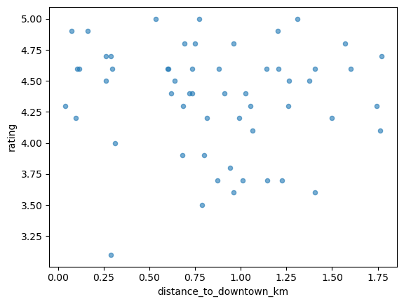

# 📍 Location-Based Restaurant Analysis: Downtown Hamilton, OH
## Project Overview

This project explores location-based patterns in restaurant quality and competition in downtown Hamilton, Ohio using publicly available business data from the Google Places API.

The goal is not to predict revenue or business success directly, but to answer practical, exploratory questions such as:

- How far does “downtown” actually extend in functional terms?

- Does proximity to downtown relate to restaurant ratings?

- How is restaurant quality distributed spatially across the urban core?

The project is designed as a foundational location-intelligence analysis that can later be extended with additional data sources (e.g., foot traffic, POS data, demographics) or machine learning models.

## Data Source

- Google Places API (Web Service)

- Business entities correspond to Google Business Profiles

- Data collected for restaurants within a 2 km radius of downtown Hamilton

## Key fields used:

- Business name and status

- Latitude / longitude

- Rating and review counts

- Price level (when available)

- Opening status

- Place ID (for deduplication and future joins)

API responses are cached locally and all downstream analysis is performed on saved datasets to avoid repeated API calls.

## Research Question 1
### 📌 How far does “downtown” extend, and does distance from downtown relate to restaurant ratings?

### Motivation:

“Downtown” is often treated as a fixed concept, but analytically it should be defined by observable changes in business patterns, not intuition or administrative boundaries.

As a first step, this analysis examines whether distance from the city center is associated with restaurant ratings.

### Methodology

#### 1. Define a downtown reference point

A single latitude/longitude coordinate representing downtown Hamilton was selected and used consistently across queries and feature engineering.

```python
DOWNTOWN_LAT = 39.3995
DOWNTOWN_LNG = -84.5613
```

#### 2. Compute distance to downtown

For each restaurant, the great-circle (Haversine) distance from downtown was calculated and added as a new feature.

```python
def haversine_km(lat1, lon1, lat2, lon2):
    R = 6371  # Earth radius in kilometers
    lat1, lon1, lat2, lon2 = map(np.radians, [lat1, lon1, lat2, lon2])
    dlat = lat2 - lat1
    dlon = lon2 - lon1
    a = np.sin(dlat/2)**2 + np.cos(lat1) * np.cos(lat2) * np.sin(dlon/2)**2
    return 2 * R * np.arcsin(np.sqrt(a))
```
```python
df["distance_to_downtown_km"] = haversine_km(
    DOWNTOWN_LAT,
    DOWNTOWN_LNG,
    df["geometry.location.lat"],
    df["geometry.location.lng"]
)
```

#### 3. Visualize ratings vs distance

A scatter plot was created to explore the relationship between distance from downtown and restaurant rating.



```python
df.plot.scatter(
    x="distance_to_downtown_km",
    y="rating",
    alpha=0.6
)
```

#### 4. Group restaurants into distance bands

To reduce noise and examine aggregate behavior, restaurants were grouped into distance bands.
```python
df["distance_band"] = pd.cut(
    df["distance_to_downtown_km"],
    bins=[0, 0.5, 1, 1.5, 2, 3],
    labels=["0–0.5km", "0.5–1km", "1–1.5km", "1.5–2km", "2–3km"]
)
```
```python
df.groupby("distance_band")["rating"].mean()
```


## Findings & Insights 🔍 Key Observations

- No strong linear relationship was observed between distance to downtown and restaurant ratings.

- Average ratings were consistently high (≈4.3–4.5) across all distance bands.

- This suggests that restaurant quality is distributed relatively evenly throughout downtown and surrounding neighborhoods.

- Proximity to downtown alone does not appear to be a strong determinant of customer satisfaction.


## Interpretation:


Restaurant ratings in Hamilton appear to be driven more by operational quality and customer experience than by location alone.

This result supports the idea that location context matters, but only when combined with additional factors such as:

- Competitive density,

- Peer quality,

- Price positioning,

- Neighborhood characteristics.


## Why This Matters

This initial finding helps rule out an overly simplistic assumption (closer = better) and motivates more meaningful follow-up questions, such as:

- Where does restaurant density drop off sharply?

- How competitive pressure changes with distance from downtown?

- Whether restaurants perform better or worse relative to nearby peers, rather than in absolute terms.

- In other words, this analysis establishes a baseline and clarifies what does not explain quality on its own.

## Next Steps:

### Planned extensions of this project include:

- Defining a functional downtown radius using business density gradients

- Measuring restaurant density and competition within walking-distance buffers

- Computing peer-relative rating metrics

- Visualizing results in an interactive Streamlit dashboard

- Exploring clustering-based definitions of downtown

- Preparing the dataset for future machine learning experiments (when outcome data is available)


Notes on Scope & Limitations

This analysis focuses on exploratory spatial patterns, not causal inference.

Ratings are used as a proxy for perceived quality, not financial performance.

Results reflect data availability and API coverage, not a complete census of all businesses.

## Project Status

### 🚧 In Progress
This repository represents an evolving analytical workflow and will be updated as additional features, visualizations, and insights are developed.